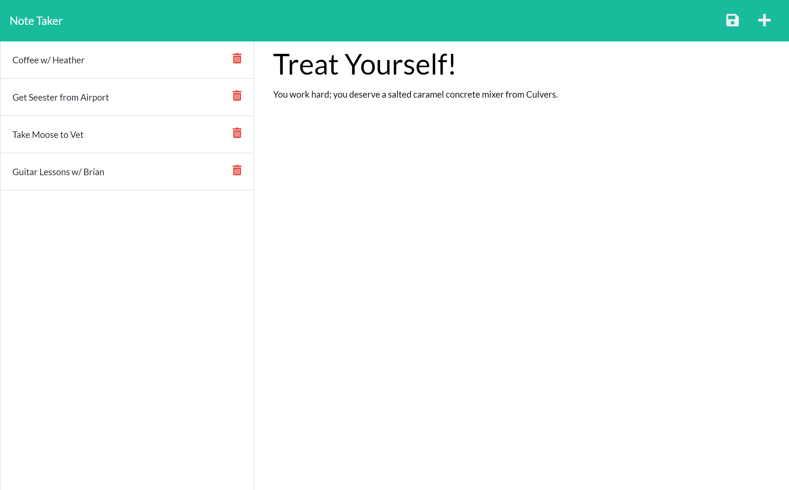
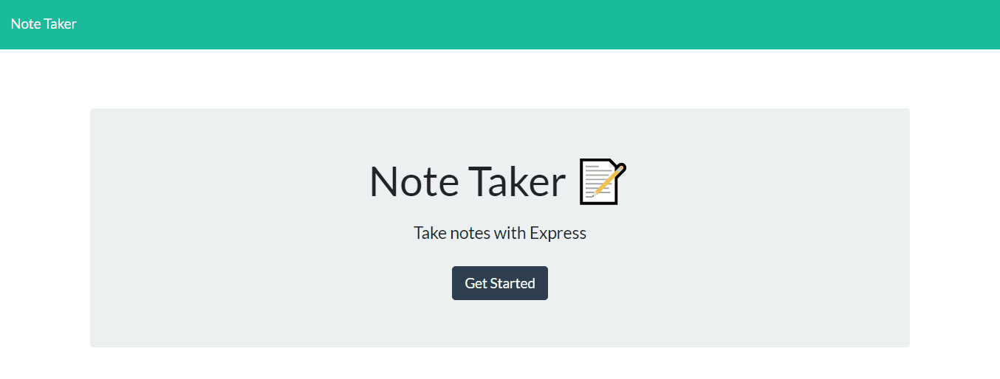

# noteTaker
A simple application to allow for writing and saving notes; a little scratch pad!

[Live site!](https://note-taker-mmonyok.herokuapp.com/)

## Description
- I built this application, so that I can easily access a digital notebook, a scratchpad, from anywhere with web access, not just on my local machine.
- This application will save you money in notepad costs; it solves the issue of easily losing your sticky notes, and it can be accessed away from home.
- Downfall of this application, is that the notes are not private and are available to anyone that uses the application.
- I learned how to properly set-up an Express.js server, get, post, delete, routes to files, how to access static folders and more. 

## Table of Contents
- [noteTaker](#notetaker)
  - [Description](#description)
  - [Table of Contents](#table-of-contents)
  - [Installation](#installation)
  - [Usage](#usage)
  - [Credits](#credits)
  - [License](#license)
  - [Contributing](#contributing)
  - [Tests](#tests)
  - [Contact](#contact)

## Installation
1. Provided that you have a code editor of your choosing installed on your system, such as VS Code (https://code.visualstudio.com/),

2. Provided that you have a Terminal installed for Windows (https://www.microsoft.com/en-us/p/windows-terminal/9n0dx20hk701?rtc=1&activetab=pivot:overviewtab) or are using a Mac with Terminal installed with the OS,

3. Provided that you have npm and Node.js installed for windows (https://www.npmjs.com/get-npm).

4. You have Git and Github Desktop installed (https://git-scm.com/downloads, https://desktop.github.com/) and have registered for an account,

5. Either Clone or Fork this repository: (https://github.com/mmonyok/READMEgenerator.git),

6. Clone the repository to your local computer and initialize npm, as well as install express and uuid node modules. 

7. Edit in your code editor and continue to commit, push changes and perform other Git actions using your repository https://docs.gitlab.com/ee/gitlab-basics/start-using-git.html.

## Usage
- Click on "Get Started" to begin entering notes!
- The "Note Taker" link in the nav bar will take you back to the home page.
- Enter a note title and the text of the note then click the save button. 
- You can select different notes to view and delete any you no longer need.

## Credits
- Technologies Used:
  - [HTML](https://www.w3schools.com/html/)
  - [CSS](https://www.w3schools.com/css/)
  - [JavaScript](https://www.w3schools.com/js/)
  - [Bootstrap](https://getbootstrap.com/)
  - [FontAwesome](https://fontawesome.com/)
  - [ScreenToGIF](https://www.screentogif.com/)
  - [Node.js](https://www.npmjs.com/get-npm)
  - [NPM](https://www.npmjs.com/get-npm)
  - [Express.js](https://expressjs.com/)
  - [Uuid Node Module](https://www.npmjs.com/package/uuid)

- Tutorials Followed:
[Professional README guide template provided by Coding Boot Camp.](https://github.com/coding-boot-camp)

## License
MIT License

Copyright (c) [2021] [Melody Monyok]

Permission is hereby granted, free of charge, to any person obtaining a copy
of this software and associated documentation files (the "Software"), to deal
in the Software without restriction, including without limitation the rights
to use, copy, modify, merge, publish, distribute, sublicense, and/or sell
copies of the Software, and to permit persons to whom the Software is
furnished to do so, subject to the following conditions:

The above copyright notice and this permission notice shall be included in all
copies or substantial portions of the Software.

THE SOFTWARE IS PROVIDED "AS IS", WITHOUT WARRANTY OF ANY KIND, EXPRESS OR
IMPLIED, INCLUDING BUT NOT LIMITED TO THE WARRANTIES OF MERCHANTABILITY,
FITNESS FOR A PARTICULAR PURPOSE AND NONINFRINGEMENT. IN NO EVENT SHALL THE
AUTHORS OR COPYRIGHT HOLDERS BE LIABLE FOR ANY CLAIM, DAMAGES OR OTHER
LIABILITY, WHETHER IN AN ACTION OF CONTRACT, TORT OR OTHERWISE, ARISING FROM,
OUT OF OR IN CONNECTION WITH THE SOFTWARE OR THE USE OR OTHER DEALINGS IN THE
SOFTWARE.

## Contributing
- Please submit any contributions you think will improve this project.

## Tests
- No further testing is needed, unless any new contributions are made; the owner of this project will locally test any contribution submissions prior to approval.

## Contact
- Melody Monyok
  - <monyokwebdev@gmail.com>
  - (612) 492-1528